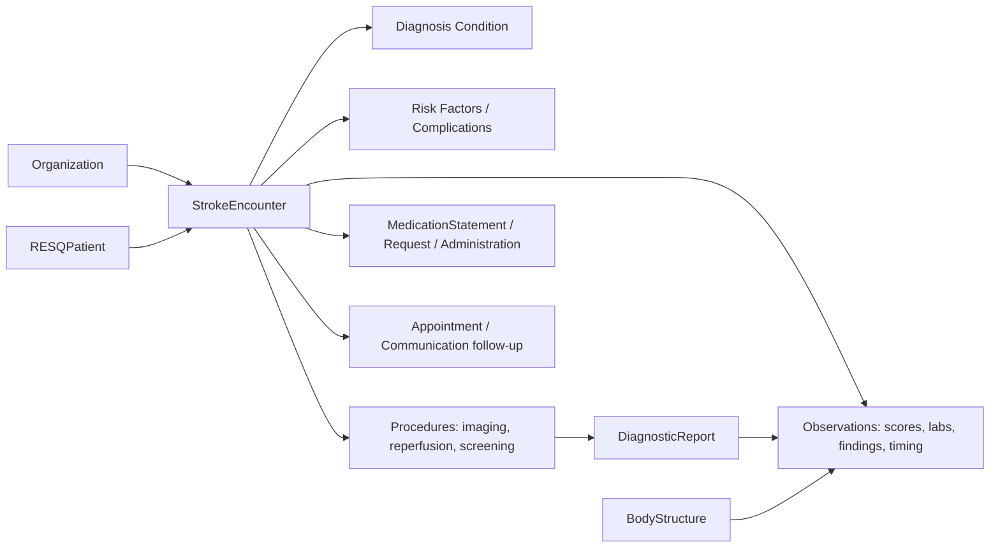

# RESQ Stroke Registry Implementation Guide

This guide describes how RES-Q stroke registry data is represented in HL7 FHIR R5. It is designed for implementers who need to create, validate, inspect or consume the FHIR resources produced from the registry transformation pipeline.

  

    
FHIR R5 implementation guide

    <h2>Stroke registry data, organized as navigable FHIR resources</h2>
    
The model turns one stroke episode into a connected resource graph: a patient and encounter anchor the record, while diagnoses, observations, procedures, medications, reports and follow-up resources describe the clinical pathway.

  

  

    <a class="resq-stat" href="profiles.html"><strong>41</strong>Profiles</a>
    <a class="resq-stat" href="extensions.html"><strong>15</strong>Extensions</a>
    <a class="resq-stat" href="terminology.html"><strong>117</strong>Terminology artifacts</a>
    <a class="resq-stat" href="resource-map.html"><strong>15</strong>FHIR resource types</a>
  

## Start here

  <a class="resq-card" href="resource-map.html">
    <strong>Resource map</strong>
    See every FHIR resource type used in the IG and how the resources connect across a stroke episode.
  </a>
  <a class="resq-card" href="modeling.html">
    <strong>Modeling decisions</strong>
    Understand why the registry is split across Patient, Encounter, Condition, Observation, Procedure and medication resources.
  </a>
  <a class="resq-card" href="profiles.html">
    <strong>Profiles by resource</strong>
    Jump directly to the StructureDefinition pages for each profile.
  </a>
  <a class="resq-card" href="terminology.html">
    <strong>Terminology</strong>
    Review the local CodeSystems and ValueSets generated from the registry enumeration model.
  </a>

## Scope

The IG covers the complete transaction bundle produced by `transform_to_fhir`: `Organization`, `Patient`, `Encounter`, `Location`, `Condition`, `Observation`, `Procedure`, `DiagnosticReport`, `BodyStructure`, `MedicationStatement`, `MedicationRequest`, `MedicationAdministration`, `PractitionerRole`, `Appointment` and `Communication`.

## Resource graph

## Modeling conventions

- `Patient` is intentionally minimal and privacy-preserving. It carries the registry identifier and a SNOMED-coded sex/gender extension; age is represented as an `Observation` because the source pipeline creates it as a measurable registry datum.
- `Encounter` is the clinical anchor for the index stroke episode. It carries admission source, discharge disposition, first-hospital flag, post-acute-care flag and EMS prenotification.
- `Condition` is used for durable clinical assertions: stroke diagnosis, risk factors and post-stroke complications.
- `Observation` is used for measurements, scales, laboratory/analytics values, imaging findings, process timings and follow-up indicators.
- `Procedure` is used for actions performed or considered in care delivery: imaging, reperfusion, swallowing screening, VTE prophylaxis, carotid endarterectomy and other stroke treatments.
- Medication resources are separated by meaning: prior medication use is `MedicationStatement`, discharge prescriptions are `MedicationRequest`, and administered acute treatment is `MedicationAdministration`.

## Known normalization notes

The Python builders include both `required-post-acute-care-ext` and `post-acute-care-required-ext`. Both are preserved as separate extension URLs because both appear in the implementation. The MedicationAdministration builders also contain a typo URL `http://tecnomod-um-org/StructureDefinition/assessment-timing-ext`; the IG normalizes this to `http://tecnomod-um.org/StructureDefinition/assessment-timing-ext`.
