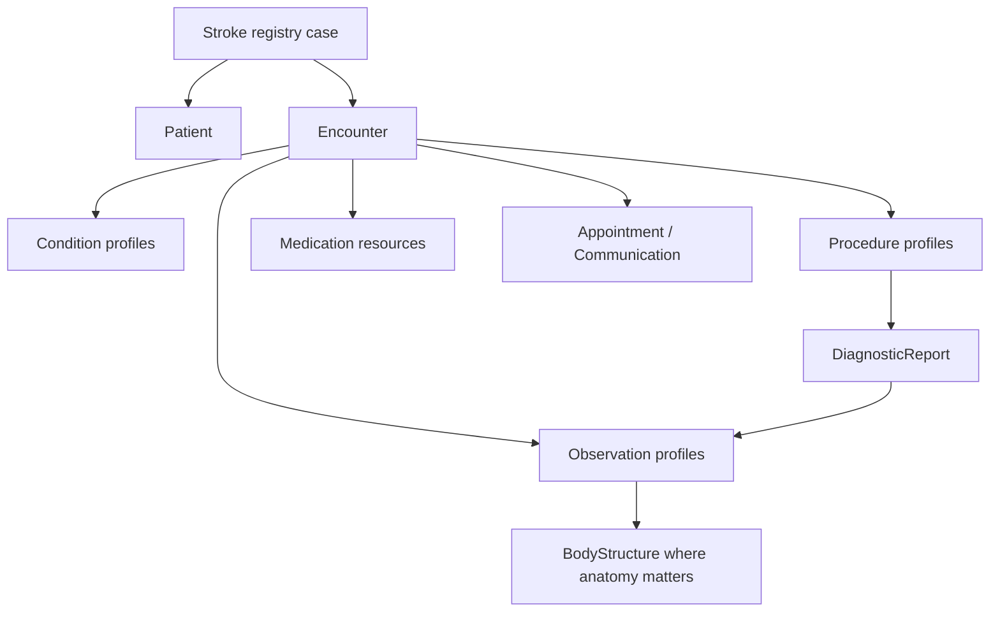

# Resource Map

The RES-Q IG models one registry case as a connected set of FHIR resources. The table below is the fastest route from a real registry concept to the resource profile that represents it.

| Resource type | What it represents | Main profiles |
| --- | --- | --- |
| `Patient` | Pseudonymized patient anchor and coded sex/gender | [RESQ Patient](StructureDefinition-resq-patient-profile.html) |
| `Encounter` | Index stroke admission and pathway context | [Stroke Encounter](StructureDefinition-stroke-encounter-profile.html) |
| `Organization` | Contributing registry hospital or organization | [Stroke Registry Organization](StructureDefinition-stroke-registry-organization-profile.html) |
| `Location` | Hospitalized location, department or care intensity | [RESQ Location](StructureDefinition-resq-location-profile.html), [Hospitalized Location](StructureDefinition-hospitalized-location-profile.html) |
| `Condition` | Diagnosis, risk factors and post-stroke complications | [Stroke Diagnosis](StructureDefinition-stroke-diagnosis-condition-profile.html), [Risk Factor](StructureDefinition-stroke-risk-factor-condition-profile.html), [Post-Stroke Complication](StructureDefinition-post-stroke-complication-condition-profile.html) |
| `Observation` | Scores, vital signs, labs, imaging findings, timings and follow-up indicators | [Observation profiles](profiles.html#observations) |
| `Procedure` | Imaging, reperfusion, screening, VTE prophylaxis and treatments | [Procedure profiles](profiles.html#procedures) |
| `DiagnosticReport` | Imaging reports and thrombectomy outcome reports | [Stroke Imaging Report](StructureDefinition-stroke-imaging-diagnostic-report-profile.html), [Mechanical Thrombectomy Report](StructureDefinition-mechanical-thrombectomy-diagnostic-report-profile.html) |
| `BodyStructure` | Anatomical sites such as occluded arteries and laterality | [RESQ BodyStructure](StructureDefinition-resq-body-structure-profile.html) |
| `MedicationStatement` | Medication use before stroke onset and adherence | [Prior MedicationStatement](StructureDefinition-prior-medication-statement-profile.html) |
| `MedicationRequest` | Medication prescribed at discharge | [Discharge MedicationRequest](StructureDefinition-discharge-medication-request-profile.html) |
| `MedicationAdministration` | Acute or post-acute medication administrations | [MedicationAdministration profiles](profiles.html#medications) |
| `PractitionerRole` | Performer category for screening procedures | [RESQ PractitionerRole](StructureDefinition-resq-practitioner-role-profile.html) |
| `Appointment` | Three-month follow-up appointment | [Follow-up Appointment](StructureDefinition-follow-up-appointment-profile.html) |
| `Communication` | Three-month contact modality and communication status | [Three-Month Communication](StructureDefinition-three-month-communication-profile.html) |

## How to Navigate

Use [Profiles](profiles.html) when you know the FHIR resource type. Use [Modeling Decisions](modeling.html) when you need to understand why a registry field was placed in a given resource. Use [Terminology](terminology.html) when a profile binds an element to a generated ValueSet.

